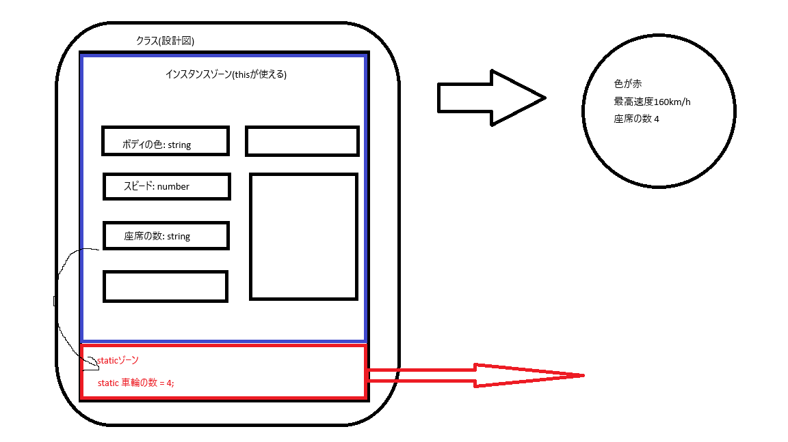

# TypeScript勉強メモ

自分のためのメモです。わかりにくくても改良はしないと思います。\
予めご理解ください。

# 環境構築
TypeScriptのコンパイラがすでにインストールされているものとする。

以下のコマンドでフォルダ初期化
```
npm init
```
作業ディレクトリにだけ追加モジュールインストール
```
npm install --save-dev lite-server
```
`package.json`の`script`を以下のようにする
```json
  "scripts": {
    "test": "echo \"Error: no test specified\" && exit 1",
    "start": "lite-server"
  },
```
以下のコマンドでローカルサーバ起動(２回目以降はこれだけやればOK)
```
npm start
```
localhost:3000で確認できる。


# 250821

## 14. 型の指定&型推論
関数のところでは`number`とか`stirng`とか指定しているけど、変数の宣言時には指定していないのはなぜ？

A. 型推論というシステムがあるから。\
TypeScriptでは、変数を初期化する際に代入される値をみて、その変数がどの型であるかを推論してくれている。\
宣言だけしているときは`number`や`string`は書いておいたほうがいい。初期化をしているときにこれらを書いても間違いではないけど、冗長なので不要。\

マジで雰囲気でつかむなら、**以下の問題を因数分解せよ。**
```math
x^2 - 9 = 0
```
という問題に直面したとき、因数分解の公式使っても解の公式を使っても間違いではないけど、前者と比較して後者は遠回り(冗長)だよね。

## 16. ネストしたObject型

もちろんネストしたObjectの型も定義できます。

次のようなJavaScript のオブジェクトを考えます。
```typescript
const product = {
  id: 'abc1',
  price: 12.99,
  tags: ['great-offer', 'hot-and-new'],
  details: {
    title: 'Red Carpet',
    description: 'A great carpet - almost brand-new!'
  }
}
```
このようなObjectの型は次のようになります。
```typescript
{
  id: string;
  price: number;
  tags: string[],
  details: {
    title: string;
    description: string;
  }
}
```

# 250825
## 49. letとconst

|              | const    | let    | var       |
| -------------- | -------- | -------- | --------- |
| 再宣言         | x        | x        | o         |
| 最代入         | x        | o        | o         |
| スコープ       | ブロック | ブロック | 関数      |
| ホイスティング | エラー   | エラー   | undefined |

### ざっくりした結論
参考にしたサイト\
[https://qiita.com/cheez921/items/7b57835cb76e70dd0fc4](https://qiita.com/cheez921/items/7b57835cb76e70dd0fc4)

-  ほぼ全部constで定義できる
    - オブジェクトや配列の値の変更は再代入にはならないため。
-  プリミティブ型を再代入したい場合はlet
-  varはもう使わない

### スコープの理解

実行中のコードから参照できる範囲をスコープといいます。\
`const/let`はブロックスコープ({}で囲われた部分 - if文やfor文など)が適用されますが、`var`はブロックスコープが適用されません。\
※ 関数スコープ(関数宣言の{})は、`var/const/let`すべてに適用されます。

```typescript
//var
{
  var a = 0;
}
// ブロックスコープが適用されないため、ブロック外でも値の参照が可能
console.log(a); // 0

//let
{
  // ブロックスコープにより、再宣言にならない。
  let a = 1;
  console.log(a); // 1
}
// letはブロックスコープであり参照できないため、varで宣言した値が参照される。
console.log(a); // 0

// const
{
  const b = 2;
  console.log(b); //2
}
// constはブロックスコープであり参照できない。
// また、bはブロック内ではじめて宣言されたため、ブロック外から読みこもうとすると
// 一度も宣言されていないものとして捉え、undefinedとなる。
console.log(b) // b is not defined 
```

### ホイスティング(変数の巻き上げ)
変数宣言が常に関数の先頭で行われたことにされる挙動を **ホイスティング(変数の巻き上げ)** といいいます。
```typescript
// var
{
  console.log(a); // undefined
  var a = 0; 
  console.log(a); // 0
}

// let / const
{
  //初期化前のbにアクセスできるわけがないよ、とエラーを出す
  console.log(b); // Cannot access 'b' before initialization 
  const b = 0; 
  //初期化後はアクセスできるので、0が表示される。
  console.log(b); // 0
}
```

# 20250829
## 69. staticメソッド&プロパティ

- 参考にしたサイト\
https://qiita.com/suema0331/items/d28b0e0fdfa1ba8572bb

### 概要
- static プロパティ/メソッドを使うと、`new`でクラスのインスタンスを作らずとも、クラスのプロパティ、メソッドを使うことができる
  - クラスに **utilityメソッド(複数箇所で使う便利ツール) を用意して、外部で使う場合**などに便利
- staticプロパティは、インスタンスからアクセスできないので、コンストラクタやstatic以外のメソッドからはアクセスできない
  - 例えば Mathクラスのメソッドも、Mathクラスをnewしなくても使える。そんな感じ
```typescript
// staticメソッドの例
Math.pow();
```

### staticプロパティの作成
- staticプロパティには、`this.(プロパティ)`のようにはアクセスできない。
  - thisは、クラスを基に作られたインスタンスを指すから！
- 代わりにクラス名を指定することで、staticプロパティにアクセスが可能！

```typescript
 class Department {
  static fiscalYear = 2021; //staticプロパティ
  protected employees: string[] = [];

  constructor(protected readonly id: string, public name: string) {
    //console.log(this.fiscalYear); //NG
    console.log(Department.fiscalYear); //OK
  }
}
```

### staticメソッドの作成
- メソッド名に`static`をつけることで、`new`しなくても外部で利用が可能
```typescript
 class Department {
  static fiscalYear = 2021; //staticプロパティ
  protected employees: string[] = [];

  constructor(protected readonly id: string, public name: string) {
    console.log(Department.fiscalYear);
  }

  static createEmployee(name: string) { //staticメソッド
    return { name: name };
  }
}


const employee1 = Department.createEmployee('NEKO'); //newしなくても使える
console.log(employee1, Department.fiscalYear);

```



## TypeScript の abstract メソッド/クラス
- 参考にしたサイト
https://qiita.com/suema0331/items/374c0757aa00b37d98bd

### TypeScript の abstractメソッド
- 親クラスのメソッドをサブクラスでオーバーライドするように強制したい場合、abstractメソッド使います
- abstractメソッドでは、具体的なメソッドの処理を書かず、戻り値のみを設定します
```typescript
  abstract describe(this: Department): void; //{};を削除、戻り値を設定
```

### ポイント
- abstractメソッドは、abstractクラスからしか使用できません
- abstract クラスは、インスタンス化ができません(`abstract`がついているクラスは、継承されることが前提のクラスということです)
- サブクラスで、必ず親クラスのabstractメソッドを実装します(親クラスでは実装がされていないため)

```typescript
//親クラス

abstract class Department {
  static fiscalYear = 2021;
  protected employees: string[] = [];

  static createEmployee(name: string) {
    return { name: name };
  }

  constructor(protected readonly id: string, public name: string) {
    console.log(Department.fiscalYear);
  }

  abstract describe(this: Department): void;

}
```

```typescript
//サブクラス1

class ITDepartment extends Department {
  admins: string[];
  constructor(id: string, admins: string[]) {
    super(id, 'IT');
    this.admins = admins;
  }

  //親クラスのabstractメソッドをサブクラスで実装する必要がある
  describe() { 
    console.log('IT部署 - ID: ' + this.id);
  }
}

//サブクラス2

class AccountingDepartment extends Department {
  private lastReport: string;

  constructor(id: string, private reports: string[]) {
    super(id, 'Accounting');
    this.lastReport = reports[0];
  }

  //親クラスのabstractメソッドをサブクラスで実装する必要がある
  describe() {
    console.log('会計部署 - ID: ' + this.id);
  }
}
```

## TypeScriptのインターフェース

### 概要
- TypeScriptのインターフェースは、オブジェクトの構造を宣言するため機能です
- インターフェースでは、プロパティと型のみ宣言します
- インターフェースはJavaScriptにない、TypeScritptの機能です

### インターフェースの使い方
- implements で、指定したインターフェースを実装します。実装したクラスを実装クラスと言います
- インターフェース実装クラスでは、インターフェースに宣言されているプロパティ・メソッドが、必ず実装されている必要があります
- インターフェース実装クラスに、インターフェースで定義されている以外のプロパティ、メソッドも追加可能です
- インターフェースは、変数の型として使う事ができます
```typescript
//インタフェース
interface Greetable {
  name: string;   //プロパティの型のみ宣言
  greet(phrase: string): void;  //メソッドの構造のみ宣言
}


//実装クラス (複数のインターフェースも実装可能)
class Person implements Greetable { 
   //インターフェースの定義以外のプロパティ、メソッドも追加可能
  name: string;
  age = 3;

  constructor(n: string) {
    this.name = n;
  }
  
  //インタフェースのメソッドを実装
  greet(phrase: string) { 
    console.log(phrase + ' ' + this.name);
  }
}


let villagerA : Greetable; //インターフェースを変数の型として使える
let heroA : Greetable;  

villagerA = new Person('村人A');  //PersonクラスのオブジェクトはGreetableを実装している
heroA = new Person('勇者A');   //同じ構造のオブジェクトを生成できる

villagerA.greet('Hello I am'); //greetメソッドを持つことを担保されている
heroA.greet('May the Force be with you, '); 

// villagerAオブジェクトの具体的な構造を気にせず、Greetableインターフェイスの greetメソッドが使える
// villagerAオブジェクトがPerson型のクラスなのか、他の型のクラスなのか、気にしなくてOKです
```

### インターフェース と type の違い
- インターフェース：オブジェクトの構造を記述することのみできます。複数なクラスで同じ機能を実装したいときに使う
- type：構造や、union型など様々な型を定義できます。用途が広い事は、メリットにもデメリットにもなります

### インターフェース と abstructクラス の違い
- abstructクラス：抽象メソッドも、具体メソッドも含めることができます
- インターフェース：メソッドを宣言するのみで、内部で実装できません

### インターフェースの修飾子
- インターフェースのプロパティを readonly に指定してプロパティを初期化の時に一度だけ設定できるようにします
- この場合、実装クラスでも、readonly のプロパティになります

```typescript
//インターフェース
interface Greetable {
  readonly name: string;
  greet(phrase: string): void;
}

 //実装クラス
class Person implements Greetable { 
  name: string;  //interfaceでreadonlyに指定してるのでreadonlyになる
  age = 3;

  constructor(n: string) {
    this.name = n;
  }

  greet(phrase: string) { 
    console.log(phrase + ' ' + this.name);
  }
}
```

### インターフェースの継承
- インターフェースでも継承が可能です
- インターフェースを細分化して定義することで、実装クラスに実装を強制する範囲を、クラスごとに変更することができます
  - 1個のインターフェースにたくさん構造を宣言してしまうと実装クラスで全部実装する必要がある
  - クラスによっては実装する必要がないものもあるから、インターフェースを小分けして、必要な分だけ取り込む、といったことをしていこうぜって話
- インターフェースは複数のインターフェースを継承可能です
  - cf: クラスは、単一のクラスのみ継承可能
- 実装クラスで、複数のインターフェースを指定して実装する事も可能です
```typescript
// インターフェースを継承可能
interface Greetable extends Named , AnotherInterface

// 複数のインターフェースを指定して実装する事も可能
class Person implements Greetable , Named { ... }
```
```typescript

interface Named {
  readonly name: string;
}

//Greetable とNamed  両方合わせたインターフェースを作成
interface Greetable extends Named {  //実装クラスに、Named のプロパティも持つことを強制できる
  greet(phrase: string): void;
}


//実装クラス
class Person implements Greetable {
  name: string;
  age = 3;

  constructor(n: string) {
    this.name = n;
  }

  greet(phrase: string) {
    console.log(phrase + ' ' + this.name);
  }
}
```

### optionalなプロパティ・メソッドを定義する
- 実装クラスに、プロパティが存在するかどうかを強制しない事ができます
  - 実装クラスに、インターフェースのプロパティが有ってもなくてもいいよ〜という事です
- インターフェースでプロパティに`?`をつけます
  - ex: `outputName?:string`
- インターフェースでプロパティに?をつけ、実装クラス内でも、`?`で任意に設定する事が可能です
- コンストラクタに`?`を設定するか、デフォルト値を設定する事で、インスタンス化する際に引数があってもなくても良いように設定できます
  - ex: `constructor(n?: string)`
  - ex: `constructor(n: string = '')`
- メソッドも?をつけて、optionalにすることができます
  - `greet?() : void;`
```typescript
interface Named {
  readonly name?: string;
  outputName?: string; //outputNameプロパティは実装クラスに必要ではない
}

interface Greetable extends Named {
  greet(phrase: string): void;
}


//実装クラス
class Person implements Greetable {
  //実装クラス内で、任意に設定可能
  name?: string;
  age = 30;

  constructor(n?: string) { //もしnが存在したら、プロパティに値を設定する
    if (n) {
      this.name = n;  
    }
  }

  greet(phrase: string) {
    if (this.name) { //nameがあれば
      console.log(phrase + ' ' + this.name);
    } else {
      console.log('Hi!');
    }
  }
}

let villager1: Greetable;
villager1 = new Person(); //引数がなくてもOK
villager1.greet('Hello I am'); //Hi!
```